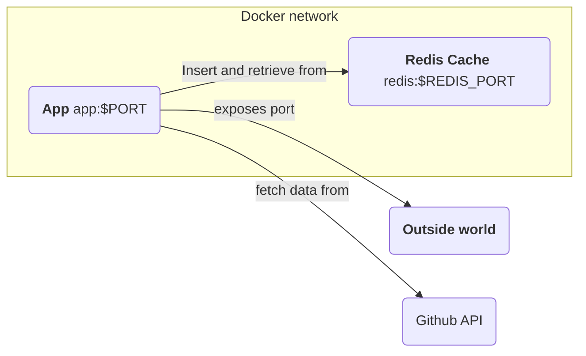
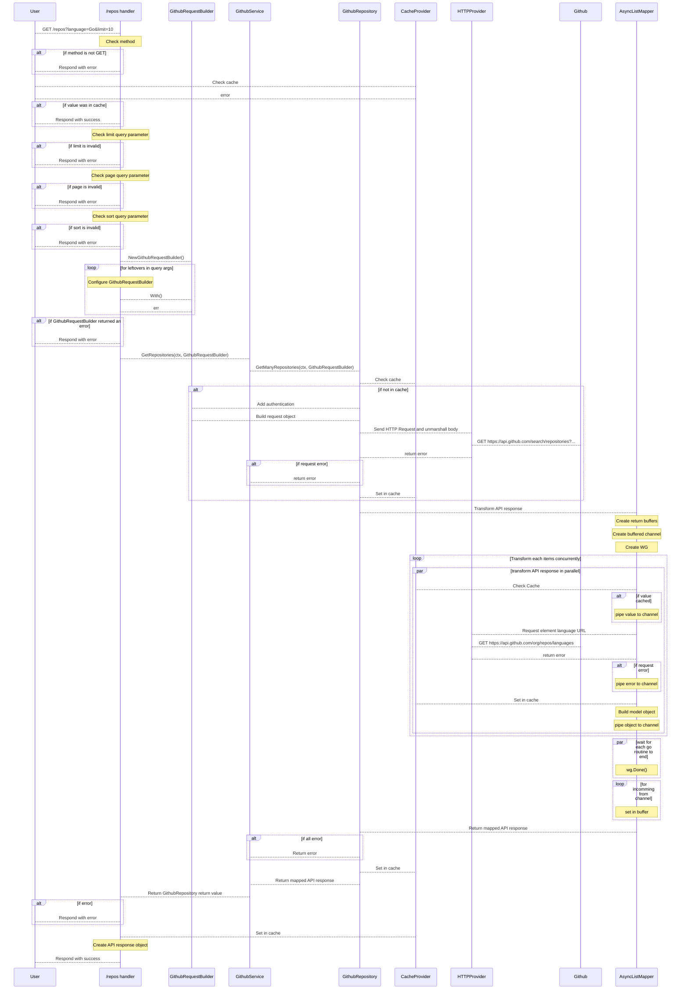

# LasramR Backend Technical Test at Scalingo

## Summary

This is my submission for the Scalingo "Hard-skills" tests.

My design focus on "Clean architecture" by ensuring that each layer of the application (transport, business logic, data fetching, ...) works independently.

With the use of common techniques such as "Dependency Injection" and "Inversion Of Control", the code I provided is decoupled and is designed to support change : the app is relying on the GitHub REST API to fetch data, wanna change to the graphQL API ? No problem, as this design of code emphasize maintainability and extendability.

Finally, given the tests constraints, attention has been given to the application performances : concurrent processing has been implemented whenever possible and data caching has been implemented in order to respond as fast as possible.

### Functionnalities

* The projects allows to retrieve aggregated data about up to 100 public Github repositories.
* By default, result will be sorted by the date they have been pushed to github but can be sorted by other
* Results can be filtered by different parameters such as : language, license, org, user, repos 
* Results contains additionnal metadata about the request such as the next page url, the total count of matching repositories on github, ...

For details see [API](#api)

## Configuration

#### Fetching source code :

```bash
git clone https://github.com/LasramR/sclng-backend-test-lasramR.git
```

#### .env based app configuration

The project rely on the usage of a `.env` files to configures internals values. These values are used to configure the app behavior and the container infrastructure. 

To start configuring the project, at project root, create a `.env` file :

```bash
touch .env
```

Then, edit the newly create `.env` file by adding variable as follows :

```py
SOME_VARIABLE=SomeValue
```

Here are the differents variables used by the projects :

| Name | Value type | Default | Optionnal |
| --- | --- | --- | --- |
|PORT | Integer between 1024 and 49152 | 5000 | Yes |
|GITHUB_API_VERSION | String | 2022-11-28 | Yes |
|GITHUB_TOKEN | String | | Yes |
|REDIS_PORT | Integer between 1024 and 49152 | 6379 | Yes |
|REDIS_PASSWORD | String | | Yes |
|CACHE_DURATION_IN_MIN | Integer > 0 | 5 | Yes |

Note: despite all these variables being optionnal, you must set up a github authentication token otherwise the app will run in limited mode (only 60 queries / hour to the GitHub REST API). To create a Github authentication token see [Github Doc](https://docs.github.com/en/authentication/keeping-your-account-and-data-secure/managing-your-personal-access-tokens#creating-a-fine-grained-personal-access-token).

Here is a sample of a working `.env` file :

```py
PORT=5000
GITHUB_TOKEN="YOUR GITHUB TOKEN"
GITHUB_API_VERSION="2022-11-28"
REDIS_PORT=6379
REDIS_PASSWORD=HelloGo
CACHE_DURATION_IN_MIN=5
```

## Execution

App can be booted using :

```bash
docker compose up
```

You must have a `.env` file, even if it is empty.

You should be able to access the app using `http://localhost:$PORT/repos`

## [API](#api)

The app exposes a single endpoint : `/repos`

### /repos

This endpoint is used to fetch aggregated results about the last public Github repositories.

#### Success

The endpoint will respond with HTTP 200 in case of a success

#### Success Response Body

The endpoint will return a jsoned object as follow :

```json
{
  "total_count": "int", // Total number of repository on github that matched the request
  "count": "int", // Number of repository returned by the API
  "content": []"null"|{ // Aggregated data from Github, null entries means that the corresponding data aggregation failed 
    "full_name": "string", // Repository full name : owner + name
    "owner": "string", // User name or organisation owning the repository
    "description": "string", // Repository description
    "repository": "string", // Repository name
    "repository_url": "string", // URL to access the repository
    "languages": { // Map of languages used in the repository
      "[key]": { // Language name
        "Bytes": "int" // Total number of bytes of this language in the repository
      }
    },
    "license": "string", // License name, can be null
    "size":, "int", // Size of the repository in bytes
    "created_at": "string", // Creation date of the repository
    "updated_at": "string" // Date of last update to the repository
  },
  "incomplete_result": "bool", // Describes if content contains null values
  "previous": "string|null", // Url pointing to the previous paginated content
  "next": "string|null" // Url pointing to the next paginated content
}
```

#### Error

If the response code is not included between 200 and 299, an error has been responded

#### Error Body

```json
{
  "status": "int", // Error HTTP status code
  "reasons": "[]string" // String array describing error
}
```

#### Filtering

Result can be filtered by different parameters using query parameters.

Here are supported filtering parameters :
* language, the main programming language of the repos 
* license, the license name of the repos
* user, the user owning the repos
* org, the organization owning the repos
* full_name, the full name of the repos

All these parameters are string parameters

Usage :
* `/repos?full_name=jquery/jquery`
* `/repos?language=python`
* `/repos?org=Scalingo`

Of course they can be additionned :
Usage :
* `/repos?org=Scalingo&language=Go`

#### Sorting

Result can be sorted with the use of the **sort** query parameter.

Sorting may take one of the following values :
* updated: Sort results by updated date time (ie datetime of `git commit` command)
* forks: Sort results by number of forks
* stars: Sort results by number of stars

Results are defaultly sorted by push time (ie datetime of `git push` command)

#### Limiting

Result count can be limited between 1 and 100 with the use of the **limit** query parameter.

**limit** is an integer between 1 and 100

Usage : `/repos?limit=50

### Examples

To easely run these test requests, set up the **PORT** env var on your host machine :

```bash
export PORT=...
```

* Get the last 100 Github repositories sorted by updated datetime :

```bash
curl http://localhost:$PORT/repos?sort=updated > last100Updated.json
```

* Get the last 10 Go repos of the Scalingo organization

```bash
curl http://localhost:$PORT/repos?org=Scalingo&language=Go&limit=10 > scalingoLast10GoRepos.json
```

* Get the jquery/jquery repository

```bash
curl http://localhost:$PORT/repos?full_name=jquery/jquery > jqueryRepository
```

### Project structure

The project structure is as follows :

```
/project-root
│
├── /api
│   └── (API related file providing transport)
│
├── /builder
│   └── (provide mecanism to build complex queries)
│
├── /model
│   └── (definition of structs from the app and fetched apis)
│
├── /providers
│   └── (abstraction of external mecanisms eg http, cache)
│
├── /repositories
│   └── (abstraction of data access)
│
├── /services
│   └── (business logic)
│
├── /utils
│   └── (utilities used accross the app)
│
├── config.go (env configuration)
└── main.go   (entry point and app setup)
```

Boot sequence :
- main.go will starts a new process
- config.go will be used to parse in environment variable
- main.go will created and configure the different layers
  - initializing providers
  - initializing services
  - initializing http server and defining route handlers

As a bonus, unit tests have been written, these are the *_test.go files next to the source code.

### Network structure

Running the app



## Design choice and operation

### API Performances

One of the main goal of the project was to respond as fast as possible.

To ensure fast responses I used :

#### Parrarel processing

To aggregate data from the Github API multiple request to the API are required to ensure scalabilty.

In my case, the data retrieving process was as follow :
* Query the github search API to retrieve data about repositories
* For each repository, query the corresponding language_url to retrieve the language stats

I implemented an [AsyncListMapper]./util/mapper.go) that allows me to concurrently transform a source array of **n** elements to a destination array of **n** element.

This function creates :
* a wait group
* a buffered chan of length n
* n go routines

And will transform an element using a Mapping function, waiting for the entire mapping process to finish thanks to the wait group.

It will will returns an array of the transformed elements and an array of error.

This function keeps the original order of the sources.

Even though this function can be used for multiple concurrent processing (ie source array needs more than n go routines to achieve the mapping process) its design focus to perform a single mapping as it suits my needs

#### Redis caching

To avoid over requesting the Github API (ending being rate limited) and to deliver faster response I implemented a Redis cache.

The redis cache is caches :
* the result of a given URL, using the [FullUrlFromRequest](./util/url.go) I added, we ensure that the order of the query parameters doesn't matter.
* each results of Github API call, some request may need to query a repository language_url we saw before, caching this responses allows us to omit the request time.

This cache also improve the horizontal scalability of our app : we may create a Kubernetes deployment with replicas that all interacts we our redis cache, to provide a better work load.

### Clean architecture

I decided to go with a "Clean architecture" approach because of the following reasoning :

* The GitHub API should not describe the usage or the data model of our app.

To ensure that the app is not coupled I used two mecanisms :
* QueryBuilder
* Mappers

My [Github Query Builder](./builder/github_request_builder.go) is a struct that takes as argument "Setter function" and "Transform function". With this struct I can create a valid Github API request given a configuration.

This means that if GitHub changes it's API, after ajusting the configuration of the Github Query Builder, the other components of my applications will not require changes.

The Mappers are function used to create an object from my API model from an external model (ie the Github API response). Thus if for some reason, Github decides to changes their API model, after adjusting the configuration of the Mappers function, the other components of my applications will not require changes.

Note: the mapping function I used are relying on the [AsyncListMapper](./util/mapper.go) discussed before.

In addition to these two mecanism, I layered the project in a traditionnal way :
* Controllers (Transport)
* Services (Business)
* Repositories (Data layer)

This layering allows me to perform dependency injection of my components, providing decoupling, easier testability and suitable for changes.

I also implemented some inversion of controll with the use of [providers](./providers), these providers exports interfaces that describes the usage of external mecanisms. These providers provides better testability and changes : if can easily changes my cache provider from redis to in-memory for example.


### Request life cycle

The following diagram represent the life cycle of a user request in the system :




## Metas

I spent around 15 hours on the test (excluding doc).

Despite the extra work, I decided to went for a clean architecture and introduce concepts such as unit testing, DI, IoC for learning purposes.

App Benchmarks :
* Filtered request about 10 Github repositories : ~1s, 0.01s cached
* Filtered request about 100 Github repositories : ~3.5s raw, 0.02s cached